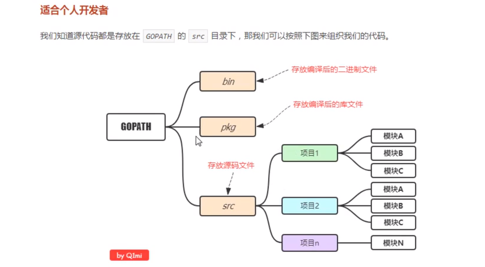

=====================
Go下载安装
=====================

GOROOT=go编译器安装目录

配置GOPATH
=====================

1、创建目录存放GO语言代码，在该目录下创建 **bin、pkg、src**,

2、在环境变量中新建 **GOPATH=存放GO语言项目代码、编译后的可执行文件、编译后的包文件路径**

3、将 **存放GO语言代码路径\bin** 添加到环境变量中

4、查看go相关环境变量 **go env**

配置GOPROXY
=========================

https://goproxy.cn

go env 查看 GO111MODULE、GOPROXY

Go项目结构
==============

个人开发
>>>>>>>>>>>>>>>>>>>>>>>

|image1|

企业开发
>>>>>>>>>>>>>>>>>>>>

|image2|

配置VS Code
>>>>>>>>>>>>>>>>>>>>>

`李文周博客`_ 

go语言格式化命令

:: 

    go fmt main.go

.. |image2| image:: ./image/20200225213706.png

.. _`李文周博客`: https://www.liwenzhou.com/posts/Go/00_go_in_vscode/

运行项目
=====================

**go run** 运行项目代码,内部会先运行编译后的文件放在系统的临时目录,然后自动执行

**go build** 运行项目代码,手动编译并生成一个可执行文件,然后再执行

**go install** 生成可执行文件+包文件,并且会将编译后的文件放在bin/pkg目录

跨平台编译
================

默认**go build** 的可执行文件都是当前操作系统可以执行文件,如果想在windows下编译linux下可执行文件需要如下操作

1、需要指定目标操作系统的平台和处理器架构

.. code-block:: shell

    SET CGO_ENABLED=0 //禁用CGO
    SET GOOS=linux  //目标平台是linux
    SET GOARCH=amd64    //目标处理器架构是amd64

2、然后执行**go build** 得到的就是能够在linux平台运行的可执行文件

Mac 下编译 Linux 和 Windows平台 64位 可执行程序：

.. code-block:: shell

    CGO_ENABLED=0 GOOS=linux GOARCH=amd64 go build
    CGO_ENABLED=0 GOOS=windows GOARCH=amd64 go build

Linux 下编译 Mac 和 Windows 平台64位可执行程序：

.. code-block:: shell

    CGO_ENABLED=0 GOOS=darwin GOARCH=amd64 go build
    CGO_ENABLED=0 GOOS=windows GOARCH=amd64 go build

Windows下编译Mac平台64位可执行程序：

.. code-block:: shell

    SET CGO_ENABLED=0
    SET GOOS=darwin
    SET GOARCH=amd64
    go build