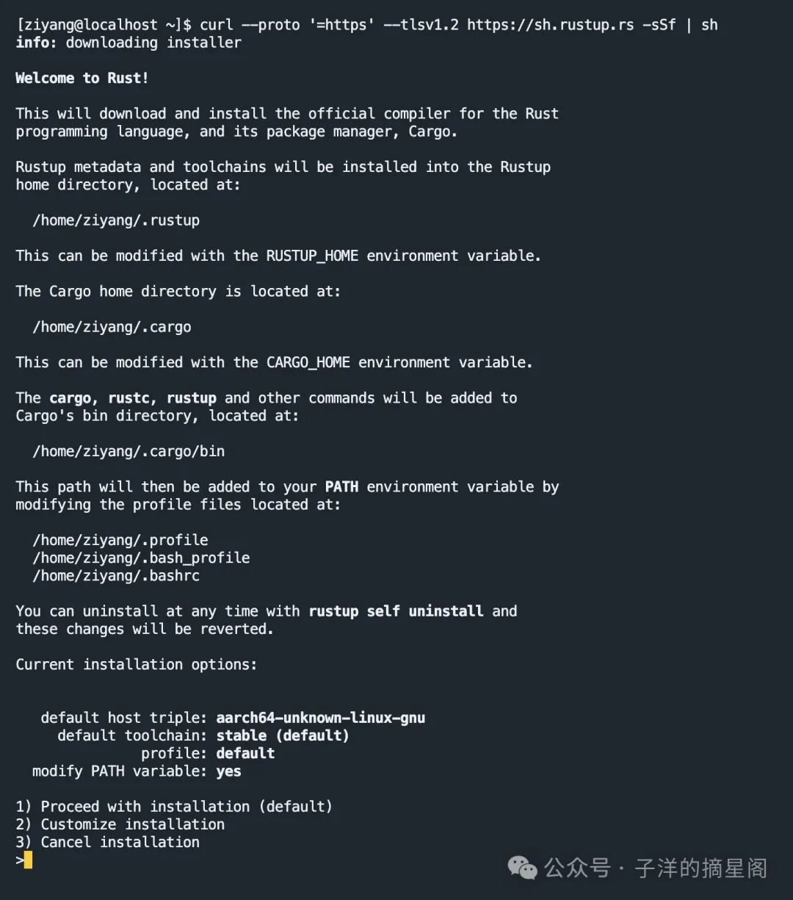
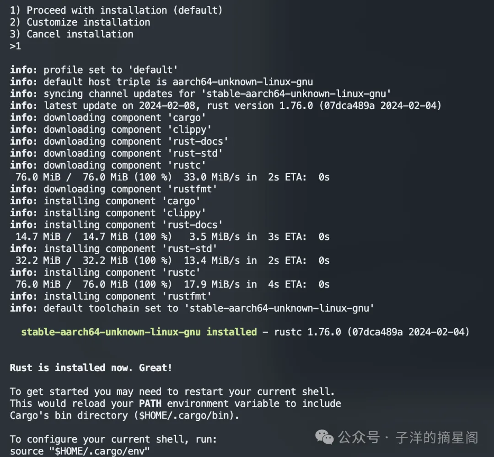

=====================
Rust下载安装
=====================

**Rust 生态系统**

Rust 生态系统由许多工具组成，主要包括：

- ``rustc``：Rust 编译器，可将 .rs 文件转换为二进制文件和其他中间格式。

- ``cargo``：Rust 依赖项管理器和构建工具。Cargo 知道如何下载托管在 https://crates.io 上的依赖项,并在构建项目时将它们传递给 ``rustc``。Cargo 还附带一个内置的测试运行程序，用于执行单元测试。

- ``rustup``：Rust 工具链安装和更新工具。当 Rust 发布新版本时，此工具用于安装并更新 ``rustc`` 和 ``cargo``。 此外， ``rustup`` 还可以下载标准库的文档。可以同时安装多个版本的 Rust， ``rustup`` 会根据需要让你在这些版本之间切换。

**Rust 版本**

Rust 有一个快速发布时间表，每六周就会发布一次新版本。新版本保持与旧版本的向后兼容性，并添加新功能。

共有三个发布阶段：“稳定版（stable）”、“测试版（beta）”和“夜间版（nightly）”。

新功能会先在“夜间版”上测试，“测试版”会每六周转为“稳定版”。

rustup
=====================

安装
----------------------

在安装 Rust 之前，首先需要安装 rustup，这是 Rust 的官方安装工具和版本管理器。它可以帮助你轻松地安装和管理不同版本的 Rust。

1. 打开终端（Terminal）。
  
2. 运行以下命令来下载并安装 rustup
  
  .. code-block:: bash
    
    # Linux or macOS
    curl --proto '=https' --tlsv1.2 -sSf https://sh.rustup.rs | sh

    # Windows
    curl --proto '=https' --tlsv1.2 -sSf https://sh.rustup.rs | sh

3. 按照提示完成安装过程。
   
  |image1|

  |image2|

  默认配置及解释如下：

  (I) **default host triple**: ``aarch64-unknown-linux-gnu`` 是一个目标三元组（target triple），用于指示编译器目标平台的体系结构、厂商、系统、和ABI（应用程序二进制接口）。这个配置告诉 Rust 编译器为哪种类型的系统构建代码。

  (#) **default toolchain**: 默认情况下，Rust 安装程序会安装 stable 版本的工具链。Rust 有几个发布渠道：稳定版（``stable``）、测试版（``beta``） 和 开发版（``nightly``）。稳定版是经过充分测试，随时可用于生产环境的版。默认使用稳定版工具链是为了保证开发的稳定性和代码的可靠性。

  (#) **profile**: default 配置文件会安装 Rust 编程语言的常用组件，例如标准库、Cargo 和 Rustfmt。Rustup 提供了不同的配置文件，如 minimal，它只安装最必要的组件，或 complete，它包含了所有可用的组件和工具。
  
  (#) **modify PATH variable**: Rust 安装程序询问是否要修改环境变量 PATH。同意修改 PATH 会将 Rust 的可执行文件路径（如 cargo、rustc 等）添加到你的系统环境变量 PATH 中。这样做的目的是为了确保你可以在任何地方（比如在终端或命令行中）运行 Rust 工具链的命令，无需指定完整的路径。

  接下来，安装程序将会安装一系列  rust 工具链：

  (I) **cargo**: Cargo 是 Rust 的包管理工具，用于管理 Rust 项目的依赖、编译和发布。它相当于其他编程语言中的 npm、pip 等工具。Cargo通过Cargo.toml文件追踪项目依赖，并且能够处理项目的构建、测试、文档生成等任务。
  
  (#) **clippy**: Clippy 是 Rust 的一种静态分析工具（Linter），用于在代码编写阶段发现常见错误和改进建议。它提供了许多lints（规则），通过对代码进行分析，帮助提升代码的质量和性能。
  
  (#) **rust-docs**: 这个组件包含了 Rust 编程语言的标准库文档。此文档允许开发者离线阅读和查找相关API的用法，是学习和参考Rust标准库的重要资料。
  
  (#) **rust-std**: 这是 Rust 的标准库组件，包含了预编译的Rust标准库，供目标平台使用。标准库提供了很多编程基础设施，如基本类型、标准宏、I/O操作、线程和并发控制工具等。
  
  (#) **rustc**: 这是 Rust 的编译器，负责将 Rust 代码编译成机器代码。rustc提供了编译、链接等功能，是Rust程序开发的核心工具。
  
  (#) **rustfmt**: Rustfmt 是一个代码格式化工具，用来自动格式化 Rust 代码风格。它通过重写源代码来保证代码风格一致，可读性和风格上的规范性，便于团队合作和项目维护。

4. 安装完成后，可能需要重新启动终端或运行以下命令来更新环境变量：

  .. code-block:: bash

    source $HOME/.cargo/env

5. 检查安装是否成功，运行以下命令检查 Rust 版本：

  .. code-block:: console

    $ rustc --version
    rustc 1.51.0 (28969aefc 2021-03-25)

6. 如果看到与类似上面的版本信息，则表示 Rust 已成功安装。

更新和卸载
----------------------

.. code-block:: bash

  rustc --version  # 验证安装是否成功

  rustup self update # 更新 rustup 本身
  rustup self uninstall	#卸载 rustup
  rustup show	# 已安装的 Rust 版本
  rustup check	# rustup 检查更新
  rustup update	# 更新到最新稳定版
  rustup target list --installed # 查看已安装的目标平台
  rustup target add <target> # 添加目标平台
  rustup target remove <target> # 移除目标平台
  rustup component list --installed # 查看已安装的组件

  rustup doc std::fmt

  rustup update stable # 更新到最新稳定版 stable/nightly/beta
  rustup default stable # 选择默认安装版 stable/nightly/beta
  rustup install stable # 安装最新稳定版 stable/nightly/beta

在 shell 中，运行 ``rustup doc std::fmt`` 会在浏览器中打开本地 std::fmt 文档

跨平台编译
-------------------------

主要优势：

- 无需依赖虚拟机
- 静态链接
- LLVM 支持
- 标准库的跨平台支持

``rustc -vV`` 输出 Rust 编译器的详细版本信息，包括 rustc 的版本、日期、主机架构和编译器类型等。

.. code-block:: console

  $ rustc -vV
  rustc 1.84.1 (e71f9a9a9 2025-01-27)
  binary: rustc
  commit-hash: e71f9a9a98b0faf423844bf0ba7438f29dc27d58
  commit-date: 2025-01-27
  host: x86_64-apple-darwin
  release: 1.84.1
  LLVM version: 19.1.5

运行 ``rustc --print target-list`` 将打印出Rust支持的所有目标平台。构建的平台的「目标三元组」（target triple）。Rust使用与LLVM[1]相同的格式。格式为<arch>-<vendor>-<sys>-<env>。
例如：

- ``x86_64-unknown-linux-gnu`` 代表一个64位Linux机器
- ``x86_64-pc-windows-gnu`` 代表一个64位的Windows机器

常见的目标三元组
>>>>>>>>>>>>>>>>>>>>>>>>>>>

.. csv-table:: Rust 目标三元组
   :file: ./code/r01_下载安装/rust_targets.csv
   :header-rows: 1
   :encoding: utf-8

工具链
=====================

cargo-edit
-----------------

包含 cargo add、cargo rm，以及 cargo upgrade，可以让我们方便地管理 crate。

.. code-block:: bash

  # 安装 cargo-edit
  # cargo-edit 是一个 Cargo 插件，提供了额外的命令来管理
  # Cargo.toml 文件中的依赖项。它允许你轻松地添加、删除和升级依赖项，而无需手动编辑 Cargo.toml 文件。      
  cargo install cargo-edit

cargo-watch
-----------------

监视项目的源代码，以了解其更改，并在源代码发生更改时，运行 Cargo 命令。

.. code-block:: bash

  # 安装 cargo-watch
  # cargo-watch 是一个 Cargo 插件，用于监视项目的源代码，当源代码发生更改时，自动运行指定的 Cargo 命令。
  # 它可以帮助开发者在代码更改时自动运行测试、编译或执行其他命令，从而提高开发效率。
  cargo install cargo-watch

  cargo watch -x 'run' # 运行并监视代码改变
  cargo watch -x 'test' # 运行并监视测试改变

参数
>>>>>>>>

- -c 清空终端

- -q 抑制 cargo watch 本身的输出

- -w 关注某个目录

- -x 运行 cargo 命令

.. code-block:: bash
  
  # 监视 src 目录下的代码更改，并在更改时运行 Cargo 命令
  # -c: 清空终端输出
  # -q: 抑制 cargo watch 本身的输出
  # -w: 关注 src 目录
  # -x: 执行 run 命令
  cargo watch -c -q -w ./src -x 'run'

rust-fmt
---------------------

.. code-block:: bash

  # 安装 rust-fmt
  cargo install rust-fmt

  cargo fmt

编辑技巧
=====================

.. code-block:: rust

  // 该属性用于隐藏对未使用代码的警告。
  #![allow(dead_code)]
  
  // 该属性用于隐藏未使用的变量警告。
  #![allow(unused_variables)]
  // 该属性用于隐藏未使用的函数警告。
  #![allow(unused_functions)]
  // 该属性用于隐藏未使用的结构体警告。
  #![allow(unused_structs)]
  // 该属性用于隐藏未使用的枚举警告。
  #![allow(unused_enums)]

